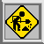

#+hugo_base_dir: ../
#+hugo_section: posts
#+startup: inlineimages

# https://ox-hugo.scripter.co/doc/custom-front-matter/
#+hugo_custom_front_matter: :framed true

#+title: Home

#+begin_quote
  Yeah, well, I'm going to go build my own site. \\
  With Emacs!  And Nix! \\
  In fact, forget the site.
  
#+end_quote

# #+caption: Pixelated construction sign of a stick figure shoveling on a bezeled gray background, in the style of a late 1990s \"Under Construction\" GIF.
